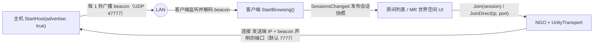

# Innovation MR NGO LAN

面向 MR（混合现实）/ Unity 项目的可复用局域网联机基础包：**Netcode for GameObjects（NGO）会话生命周期 + IPv4 UDP 广播发现**，封装成一个标准 UPM 包。

- **发现**：主机以固定间隔在局域网内广播会话 beacon，客户端监听并得到经过校验的会话快照。
- **连接**：客户端对发现结果一键入会；广播不可用（VPN、热点、企业 Wi-Fi）时用 `JoinDirect` 直连 IP 兜底。
- **安全扩展点**：连接审批委托 `ConnectionApprover`，认证决策留给应用层。
- **克制**：不绑定任何 MR/XR SDK、不做场景管理、不含 UI——只负责「发现并建立会话」这一层。

> 当前版本 0.1.0 · Unity 6（最低 `6000.0`）· NGO `2.12.0` · Unity Transport · WebGL 不支持发现

## 工作原理



协议写死的不变量（改动即破坏兼容，需升级 `LanDiscoveryProtocol.Format`）：

| 设计点 | 行为 |
| --- | --- |
| 连接 IP | 一律取自 UDP 数据报的发送端地址，不信任广播 JSON 里的自报地址 |
| 游戏端口 | 取自通过校验的 beacon 载荷，强制落在 `1..65535` |
| 报文校验 | magic（`0x494D5231`，即 `"IMR1"`）与 format（当前为 1）都通过才接受 |
| 线程模型 | UDP 接收/解码可在主线程外；事件与状态变更始终回到 Unity 主线程 |
| 资源上限 | 会话缓存 ≤ 64、接收队列 ≤ 256、每帧处理 ≤ 64、beacon ≤ 4096 字节 |
| 快照隔离 | `Sessions` 与 `SessionsChanged` 每次返回独立快照，外部修改不影响内部注册表 |
| 场景管理 | 包内保持 NGO Scene Management 关闭，场景编排完全归应用层 |

## 安装

三种方式任选其一：

1. **嵌入包**：把 `Packages/com.innovationmr.ngo-lan` 复制到你工程的 `Packages/` 目录。
2. **本地磁盘**：Package Manager → `Add package from disk` → 选择包内的 `package.json`。
3. **Git URL**（本仓库已发布）：

   ```text
   https://github.com/dailiuyi/innovation-MR.git?path=Packages/com.innovationmr.ngo-lan
   ```

然后导入示例：Package Manager 选中 **Innovation MR NGO LAN** → **Samples** → Import **Basic LAN Lobby**。

## 场景搭建（5 分钟）

1. 空场景里新建一个 `Network` GameObject。
2. 添加 `NetworkManager`（自带 `UnityTransport`）和 `LanDiscoveryService`。
3. 添加 `NgoLanSessionController`，把上面两个组件拖进它的引用。
4. 需要 NGO 自动生成玩家对象时，设置 `NetworkManager > Player Prefab`（带 `NetworkObject` 的 prefab）；否则留空，由业务层自行生成。
5. 场景加载由你的应用负责（包已关闭 NGO Scene Management），并保证所有参与端使用一致的 NetworkPrefab 配置。

## 最小用法

```csharp
using InnovationMR.NgoLan.Session;

// 场景里已配好 NgoLanSessionController（引用 NetworkManager + UnityTransport + LanDiscoveryService）
[SerializeField] private NgoLanSessionController sessions;

// —— 主机侧：启动 NGO 并以 1 秒间隔广播 beacon ——
sessions.StartHost(advertise: true);
// 或专用服务器：sessions.StartServer(advertise: true);

// —— 客户端侧：浏览局域网会话 ——
sessions.StartBrowsing();
sessions.Discovery.SessionsChanged += list =>
{
    // list 是 IReadOnlyList<LanSessionInfo> 快照：名称、IP、端口、人数、版本、业务 Metadata
    // 在这里刷新 MR 世界空间房间列表
};

// —— 加入 ——
sessions.Join(selectedSession, connectionPayload);          // 加入发现的会话
sessions.JoinDirect("192.168.1.20", 7777, connectionPayload); // 广播不可用时直连

// —— 离开 / 关服 ——
sessions.Shutdown();
```

事件一览：

| 事件 | 触发时机 |
| --- | --- |
| `NgoLanSessionController.PeerConnected(ulong)` | 远端玩家完成连接 |
| `NgoLanSessionController.PeerDisconnected(ulong)` | 远端玩家断开 |
| `NgoLanSessionController.SessionStopped` | 本地会话结束 |
| `NgoLanSessionController.SessionError(string)` | 启动/连接过程出错 |
| `LanDiscoveryService.SessionsChanged(IReadOnlyList<LanSessionInfo>)` | 发现的会话集合变化（快照） |
| `LanDiscoveryService.DiscoveryError(string)` | 发现服务自身出错（如端口被占用） |

> `StartHost` / `StartServer` / `Join` 返回 `true` 只表示 **NGO 接受了本地启动请求**，不证明远端已连接、也不证明广播可达。真正的连接结果看上面的事件和 `LastDisconnectReason`。

## 连接审批（建议必配）

默认审批只检查人数上限，而广播既不加密也不认证。生产项目的 Host/Server 启动前应设置审批策略：

```csharp
sessions.ConnectionApprover = request =>
{
    // request.ConnectionData 是客户端携带的连接 payload
    bool ok = /* 校验应用协议版本、房间口令/短期签名、设备身份等 */;
    return (ok, ok ? string.Empty : "版本或口令不匹配");
};
```

建议校验：应用协议版本、用户/设备身份、房间口令或短期 HMAC、MR 能力与 Anchor/地图兼容性、`ConnectionData` 长度上限。

## 默认参数

| 参数 | 默认值 |
| --- | --- |
| 发现端口（UDP 广播） | `47777` |
| 游戏端口（NGO 连接） | `7777` |
| 广播间隔 | 1 秒 |
| 会话过期 | 4 秒未刷新 |
| 会话缓存 | 最多 64 个 |
| 接收队列 | 最多 256 条，每帧处理 64 条 |
| beacon 上限 | 4096 字节 |

## 已知限制

- IPv4 广播：不跨路由器/VLAN，无 NAT 穿透，不支持 IPv6 组播。
- WebGL：没有原生 UDP Socket，不支持发现（游戏连接不受此限）。
- VPN、热点、企业 Wi-Fi、移动系统「本地网络」权限和防火墙都可能阻断发现——此时用 `JoinDirect`。
- 广播未加密未认证，仅适用于可信局域网；含不可信设备时依赖 `ConnectionApprover`。

## MR 接入边界

这个包刻意不负责：头显/手柄/手/Avatar 的状态同步、Spatial Anchor 的创建共享与解析、Colocation/共同空间校准、平台账户与 UI、Relay/云匹配。

建议做法：在独立的 `NetworkBehaviour` 里同步头和手的局部姿态；Anchor ID 或校准模式作为**受业务层验证的**会话元数据（`LanSessionInfo.Metadata`，不可信输入）或连接 payload 传递，不写入发现协议核心。

## 项目结构

```text
Packages/com.innovationmr.ngo-lan/
├── Runtime/
│   ├── Session/NgoLanSessionController.cs   # Host/Server/Client 生命周期 + 审批扩展点
│   └── Discovery/
│       ├── LanDiscoveryService.cs           # UDP 广播/监听、缓存与过期
│       ├── LanDiscoveryProtocol.cs          # beacon 编解码（magic/format/长度校验）
│       ├── LanSessionInfo.cs                # 只读会话结构
│       └── LanSessionRegistry.cs            # 有界注册表与快照
├── Samples~/BasicLanLobby/                  # UI 无关的最小接线示例
├── Tests/EditMode/                          # 纯逻辑 EditMode 测试
├── Documentation~/                          # AGENT_INTEGRATION / ARCHITECTURE 深度文档
├── CHANGELOG.md · LICENSE.md · THIRD_PARTY_NOTICES.md
└── package.json
```

## 测试

包内含 EditMode 纯逻辑测试，覆盖：UTF-8 报文往返与发送端 IP 组合、畸形/超大报文拒绝、TTL 边界与重复发现续期、会话容量上限。目标设备（尤其 Quest/Android 的本地网络权限、防火墙、多网卡、同机双实例）的 PlayMode 联调清单见[包内 README](Packages/com.innovationmr.ngo-lan/README.md)。

## 深入文档

- [包 README](Packages/com.innovationmr.ngo-lan/README.md) —— 完整使用文档与平台注意事项
- [AGENT_INTEGRATION.md](Packages/com.innovationmr.ngo-lan/Documentation~/AGENT_INTEGRATION.md) —— 给自动化 Agent / 新接手开发者的接入手册
- [ARCHITECTURE.md](Packages/com.innovationmr.ngo-lan/Documentation~/ARCHITECTURE.md) —— 分层、生命周期与协议兼容规则
- [THIRD_PARTY_NOTICES.md](Packages/com.innovationmr.ngo-lan/THIRD_PARTY_NOTICES.md) —— 来源归属说明

## 许可证与来源

源代码采用 [Unlicense](Packages/com.innovationmr.ngo-lan/LICENSE.md)（公有领域奉献）。网络分层与 LAN 广播方案参考并重构自 `Reinisch/Warcraft-Arena-Unity`（commit `012d73a3…`），未复制其任何 Warcraft/Blizzard 美术、音频、商标或游戏内容。
